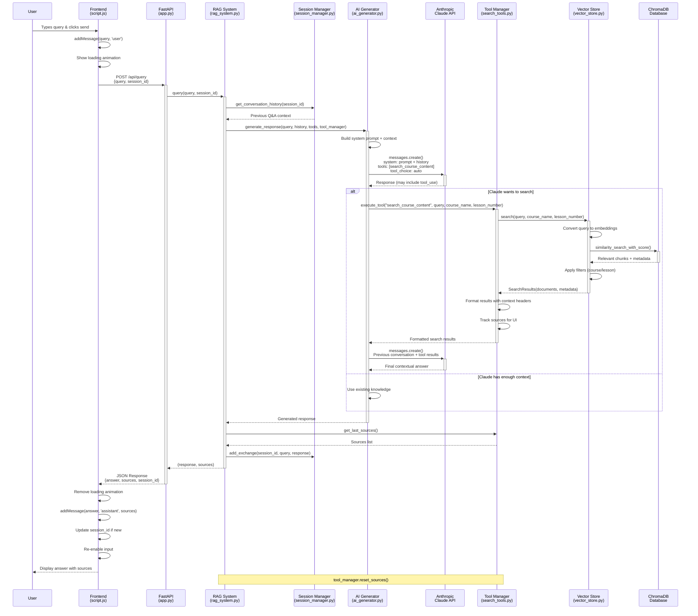

# RAG System Query Processing Flow

## Flow Components

### 🎨 **Frontend Layer**
- **User Interface**: HTML form with chat messages
- **JavaScript**: Event handling, API calls, UI updates
- **Session Tracking**: Maintains `currentSessionId` for context

### 🚀 **API Layer** 
- **FastAPI**: REST endpoint `/api/query`
- **Request Validation**: Pydantic models
- **Response Formatting**: JSON with answer + sources

### 🧠 **RAG Orchestration**
- **Query Processing**: Combines user input with conversation history
- **Component Coordination**: Manages AI, tools, and session state
- **Response Assembly**: Merges AI output with source attribution

### 🤖 **AI Generation**
- **System Prompt**: Instructions for educational assistance
- **Tool Integration**: Provides Claude with search capabilities  
- **Context Management**: Includes conversation history
- **Two-Phase Process**: Initial reasoning → Tool execution → Final answer

### 🔍 **Search Tools**
- **Semantic Search**: Vector similarity matching
- **Smart Filtering**: Course name and lesson number filters
- **Source Tracking**: Maintains attribution for UI
- **Result Formatting**: Contextual headers with course/lesson info

### 💾 **Data Layer**
- **Vector Store**: Sentence transformer embeddings
- **ChromaDB**: Vector database with metadata
- **Session Storage**: Conversation history persistence
- **Document Chunks**: Pre-processed course content

### 🔄 **Key Features**
- **Intelligent Tool Use**: Claude decides when to search
- **Conversation Context**: Multi-turn dialogue support  
- **Source Attribution**: Transparent content sourcing
- **Real-time UI**: Loading states and progressive enhancement